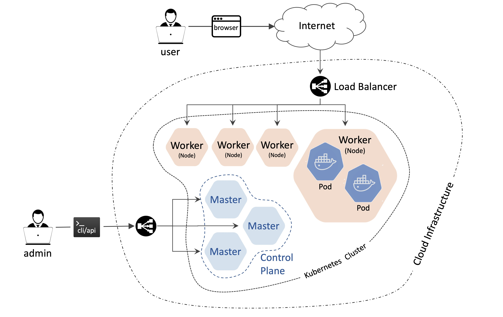
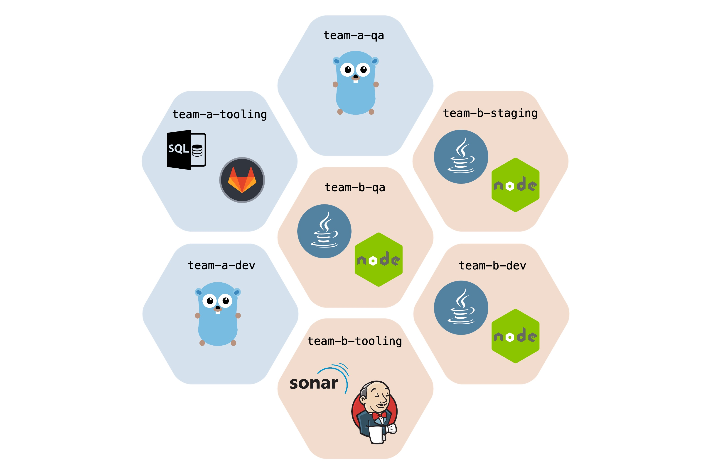
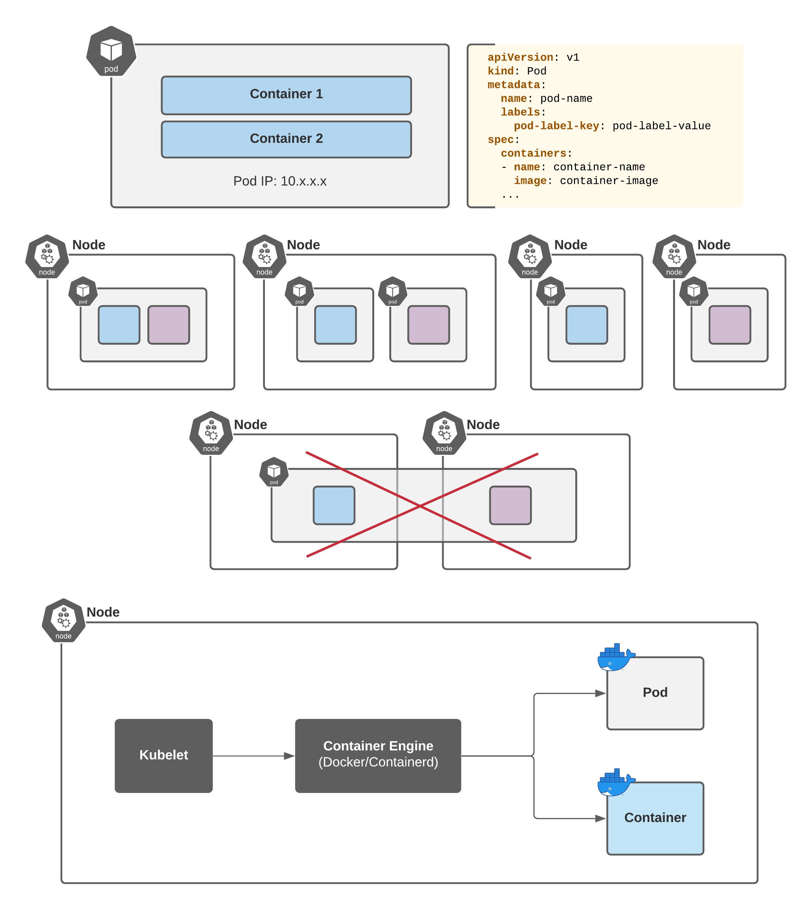
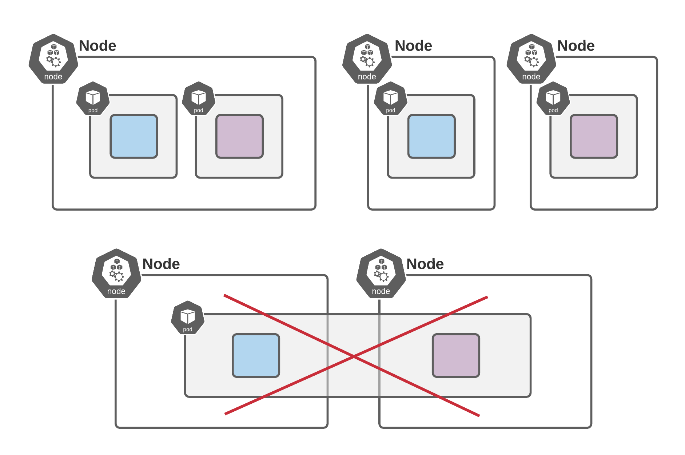
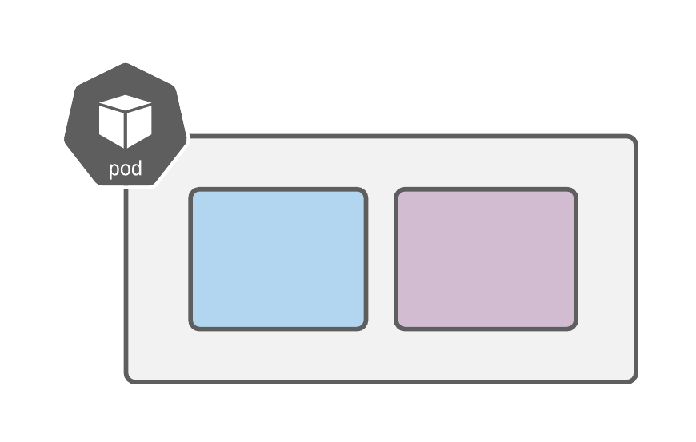
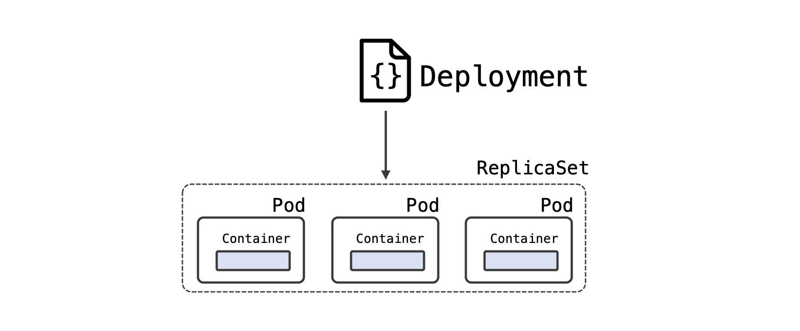
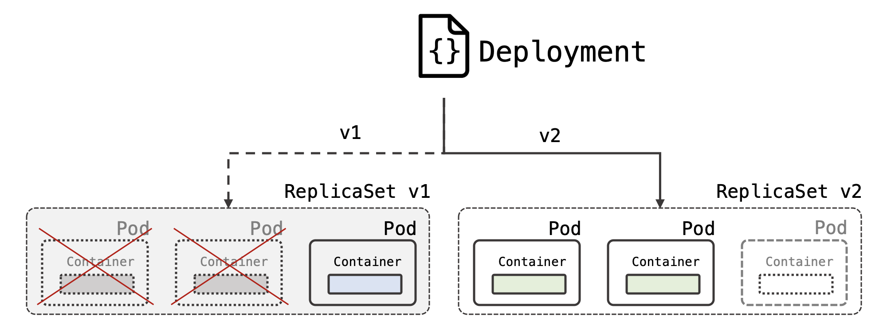
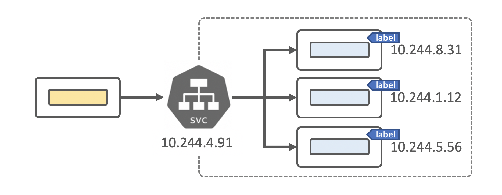

# Kubernetes Fundamentals
- What Kubernetes is
- How Kubernetes manages workloads
- Kubernetes Namespaces
- Kubernetes Pods
- Kubernetes Deployments
- Kubernetes Services

How k8s works - Microsoft - https://youtu.be/daVUONZqn88



Kubernetes cluster is running across servers. There’re several roles assigned to underlying servers:

**Master(s)** - responsible for maintaining the desired state for your cluster. When you interact with Kubernetes, such as by using the kubectl command-line interface, you’re communicating with your cluster’s Kubernetes master. The “master” refers to a collection of processes managing the cluster state
**Node(s)/Worker(s)** - the machines (VMs, physical servers, etc) that run your applications and cloud workflows. The Kubernetes master controls each node; you’ll rarely interact with nodes directly.

```sh
root@client~# kubectl cluster-info
Kubernetes control plane is running at https://api.k8slab.playpit.net:6443
CoreDNS is running at https://api.k8slab.playpit.net:6443/api/v1/namespaces/kube-system/services/kube-dns:dns/proxy

To further debug and diagnose cluster problems, use 'kubectl cluster-info dump'.
```

## 1. Working with Cluster

### Getting Cluster Info
```sh
kubectl cluster-info
```

### Getting Cluster members
```sh
kubectl get nodes
kubectl get nodes -o wide
```

Documentation:
https://kubernetes.io/docs/concepts/overview/what-is-kubernetes/
https://kubernetes.io/docs/concepts/


Cluster -> Multiple nodes
Node -> Single/multiple roles (control-plane, master, worker)

## 2. Namespaces

Kubernetes supports multiple virtual clusters backed by the same physical cluster. These virtual clusters are called Namespaces.

Namespaces provide a scope for names. Names of resources need to be unique within a namespace, but not across namespaces. Namespaces can not be nested inside one another and each Kubernetes resource can only be in one namespace.

**Namespaces** divide cluster resources **logically**
**Nodes** are **VMs**

There’s no need to use multiple namespaces - just to separate slightly different resources, such as different versions of the same software: use `labels` to distinguish resources within the same namespace.

Kubernetes starts with `4` initial namespaces:

- **default** - The default namespace for objects with no other namespace
- **kube-system** - The namespace for objects created by the Kubernetes system
- **kube-public** - This namespace is created automatically and can be read by all users (including those not authenticated). This namespace is mostly reserved for cluster usage, in case that some resources should be visible and readable publicly throughout the whole cluster. The public aspect of this namespace is only a convention, not a requirement.
- **kube-node-lease** - This namespace holds Lease objects associated with each node. Node leases allow the kubelet to send heartbeats so that the control plane can detect node failure.

Working with most of the resources in Kubernetes requires providing namespace name explicitly:

```sh
$ kubectl get pods -n kube-system
```

### Working with Namespaces

#### Viewing Namespaces:

```sh
$ kubectl get namespaces
NAME                STATUS   AGE
kube-system         Active   5m17s
default             Active   5m17s
kube-public         Active   5m17s
kube-node-lease     Active   5m17s
```

```sh
$ kubectl get namespaces --show-labels
$ kubectl get ns ${NS_NAME}
$ kubectl describe ns ${NS_NAME}
```

#### Viewing Resources in Namespace:

```sh
## For default Namespace:
$ kubectl get pods
$ kubectl get deployment

## Working with other namespaces:
$ kubectl get pods -n ${NS_NAME}
$ kubectl get rs -n ${NS_NAME} # replica sets
$ kubectl get all -n ${NS_NAME}

## Getting Pods from All Namespaces:
$ kubectl get pods -A
$ kubectl get pods --all-namespaces
```

### Documentation
[https://kubernetes.io/docs/concepts/overview/working-with-objects/namespaces/](https://kubernetes.io/docs/concepts/overview/working-with-objects/namespaces/)


## 3. Creating and Deleting Namespaces

### Namespace Definition:

namespace.yaml:
```yaml
apiVersion: v1
kind: Namespace
metadata:
  name: ffc-qa
  labels:
    cost_object: "27000"
    team_code: ffc
```

### Working with Namespaces:
```sh
## Creating/Deleting
kubectl apply -f namespace.yaml
kubectl create ns ${NS_NAME}
kubectl delete ns ${NS_NAME}

## Labeling Resources
kubectl label ${RESOURCE_TYPE} ${RESOURCE_NAME} key=value
```

### Task:
1. Create `brent-wider`Namespace
2. Delete `kristine-hudson` Namespace
3. Create `tsrivastava` Namespace and label it as required below:
   - `name=Tushar`
   - `surname=Srivastava`

### Validate:

```sh
## Checking that 'brent-wider' ns exists
$ kubectl get ns brent-wider --no-headers
brent-wider   Active   66s

## Checking that 'kristine-hudson' ns doesn't exist
$ kubectl get ns kristine-hudson
Error from server (NotFound): namespaces "kristine-hudson" not found

## Checking Labels
$ kubectl get ns tsrivastava --show-labels --no-headers
tsrivastava   Active   4m56s   name=Tushar,surname=Srivastava

$ kubectl get ns \
    -l name=Tushar \
    -l surname=Srivastava \
    -o jsonpath='{.items[*].metadata.name}'
tsrivastava
```

### Documentation:
- [https://kubernetes.io/docs/concepts/overview/working-with-objects/namespaces/](https://kubernetes.io/docs/concepts/overview/working-with-objects/namespaces/)
- [https://kubernetes.io/docs/tasks/administer-cluster/namespaces-walkthrough/](https://kubernetes.io/docs/tasks/administer-cluster/namespaces-walkthrough/)

## 4. Pods



A Kubernetes **Pod** is a group of containers with shared storage, network, and cgroup that are always scheduled to run on the **same node**. A pod is also the the smallest deployable unit of compute that can be created and managed by Kubernetes.

### Pod Manifest Example:

```sh
apiVersion: v1
kind: Pod
metadata:
  name: myapp-pod
  labels:
    app: myapp
spec:
  containers:
  - name: myapp-container
    image: busybox:1.34
    command: ['sh', '-c', 'echo Hello Kubernetes! && sleep 3600']
```

### Working with Pods:
```sh
kubectl get po
kubectl get pod
kubectl get pods
kubectl get pods --all-namespaces
kubectl get pods -A
kubectl get pods -n ${NS_NAME}
kubectl get pods ${POD_NAME}
kubectl get pods ${POD_NAME} -n ${NS_NAME}
kubectl get pods ${POD_NAME} -o yaml
kubectl get pods ${POD_NAME} -o wide

kubectl describe pods ${POD_NAME} 
kubectl describe pods ${POD_NAME} -n ${NS_NAME} 

kubectl apply -f pod-manifest.yaml
kubectl delete -f pod-manifest.yaml

kubectl run ${POD_NAME} [-n ${NS_NAME}] --image=${POD_IMAGE}
kubectl run ${POD_NAME} [-n ${NS_NAME}] --image=${POD_IMAGE} -- {command}
kubectl run ${POD_NAME} [-n ${NS_NAME}] --image=${POD_IMAGE} --command {command}
```

### Documentation
- [https://kubernetes.io/docs/concepts/workloads/pods/](https://kubernetes.io/docs/concepts/workloads/pods/)

## 5. Pods
You might probably looking for the details like where the pod is running on (node name), pod ip address, its containers and images, pod status details and so on



### Investigating Pod’s details:
```sh
kubectl get pods [-n ${NS_NAME}]
kubectl get pods ${POD_NAME} [-n ${NS_NAME}]
kubectl get pods ${POD_NAME} [--all-namespaces]
kubectl get pods ${POD_NAME} -o yaml
kubectl get pods ${POD_NAME} -o wide

kubectl describe pods ${POD_NAME} 
kubectl describe pods ${POD_NAME} [-n ${NS_NAME}]
```

### Documentation
- [https://kubernetes.io/docs/concepts/workloads/pods/](https://kubernetes.io/docs/concepts/workloads/pods/)

### Task:
A pod has just been created. Find it by creation time. Investgate its details and answer the quiz below

## 6. Pods


### Working with Pods:
```sh
kubectl get po ${POD_NAME} -o yaml
kubectl describe po ${POD_NAME}
```
### Task
We’ve just created `stranger` POD. Ignore the state of the POD for now. Please look into its detail and answer questions below:

Checking `stranger` pod:

```sh
root@client  ~ # kubectl get pod stranger
NAME       READY   STATUS         RESTARTS   AGE
stranger   1/2     ErrImagePull   0          43s

root@client  ~ # kubectl get pod stranger
NAME       READY   STATUS             RESTARTS   AGE
stranger   1/2     ImagePullBackOff   0          50s
```

### Documentation:
- Troubleshooting ImagePullBackOff: [https://managedkube.com/kubernetes/k8sbot/troubleshooting/imagepullbackoff/2019/02/23/imagepullbackoff.html](https://managedkube.com/kubernetes/k8sbot/troubleshooting/imagepullbackoff/2019/02/23/imagepullbackoff.html)
- 10 Most Common Reasons Kubernetes Deployments Fail: [https://managedkube.com/kubernetes/k8sbot/troubleshooting/imagepullbackoff/2019/02/23/imagepullbackoff.html](https://managedkube.com/kubernetes/k8sbot/troubleshooting/imagepullbackoff/2019/02/23/imagepullbackoff.html)

```sh
kubectl edit pod POD_NAME
```

## 12. Deployments


A Kubernetes deployment manages scheduling and lifecycle of pods. Deployments provide several key features for managing pods, including rolling out pods updates, rolling back, and easily scaling pods horizontally.



### Useful Commands:

```sh
kubectl apply -f deployment.yaml
kubectl get deploy
kubectl get deploy --show-labels
kubectl get deploy -n ${NS_NAME}
kubectl get deploy -o yaml
kubectl describe deploy -n ${NS_NAME}
kubectl delete deploy ${NS_NAME}
```

### Deployment Manifest Example:

```sh
apiVersion: apps/v1
kind: Deployment
metadata:
  name: nginx-deployment
  labels:
    app: nginx
spec:
  replicas: 3
  selector:
    matchLabels:
      app: nginx
  template:
    metadata:
      labels:
        app: nginx
    spec:
      containers:
      - name: nginx
        image: nginx:1.7.9
        ports:
        - containerPort: 80
```

### Documentation:
- [https://kubernetes.io/docs/concepts/workloads/controllers/deployment/](https://kubernetes.io/docs/concepts/workloads/controllers/deployment/)


### Verification:
View multiple resource types together
```sh
kubectl get deploy,pods -n simians 
NAME                                READY   UP-TO-DATE   AVAILABLE   AGE
deployment.extensions/crazymonkey   12/12   12           12          30m

NAME                               READY   STATUS    RESTARTS   AGE
pod/crazymonkey-6c57fcb44b-2d7wv   1/1     Running   0          82s
pod/crazymonkey-6c57fcb44b-2gg9z   1/1     Running   0          76s
pod/crazymonkey-6c57fcb44b-6s7hj   1/1     Running   0          82s
pod/crazymonkey-6c57fcb44b-9qd8f   1/1     Running   0          82s
pod/crazymonkey-6c57fcb44b-cn2nz   1/1     Running   0          78s
pod/crazymonkey-6c57fcb44b-ffc2q   1/1     Running   0          78s
pod/crazymonkey-6c57fcb44b-gpqh4   1/1     Running   0          79s
pod/crazymonkey-6c57fcb44b-jtjdk   1/1     Running   0          82s
pod/crazymonkey-6c57fcb44b-ptklz   1/1     Running   0          82s
pod/crazymonkey-6c57fcb44b-skhdc   1/1     Running   0          82s
pod/crazymonkey-6c57fcb44b-tkf2l   1/1     Running   0          77s
pod/crazymonkey-6c57fcb44b-v9444   1/1     Running   0 
```

## 14. Service (SVC)



Kubernetes Pods are mortal. They are born and when they die, they are not resurrected. If you use a Deployment to run your app, it can create and destroy Pods dynamically.

Each Pod gets its own IP address, however in a Deployment, the set of Pods running in at the moment in time could be different from the set of Pods running that application a moment later.

> `Service` aggregates pods at backend and acts as a LoadBalancer. It’s a single point for all pods behing (it makes no sense to aggregate different applications, we use it only for multiple replicas of the same application). It has own IP Address (type: `ClusterIP`, if it’s not headless - type: `None`), DNS Name (available inside cluster). Also, service is used as a mean for exposing Pod’s Port to Node’s Port (type: `NodePort`). In Clouds service can initiate creating of Cloud LoadBalancer in order to route traffic from Cloud Infrastructure inside Kubernetes Cluster (type: `LoadBalancer`)

### Example of the Service:
```sh
apiVersion: v1
kind: Service
metadata:
  name: service-name
spec:
  selector:
    app: << set the same label as deployment has >>
  ports:
    - protocol: TCP
      # Incoming Port on the Service
      port: 80
      # Incoming Port on Pod(s)
      targetPort: 8080
```

### Validation:
Checking if svc has own IP

```sh
$ kubectl get svc pod-info-svc
NAME           TYPE        CLUSTER-IP      EXTERNAL-IP   PORT(S)   AGE
pod-info-svc   ClusterIP   10.102.161.86   <none>        80/TCP    13s
```

Checking if our svc (ep) has discovered backends

```sh
$ kubectl describe ep pod-info-svc
Name:         pod-info-svc
Namespace:    default
Labels:       <none>
Annotations:  endpoints.kubernetes.io/last-change-trigger-time: 2020-12-28T22:36:25Z
Subsets:
  Addresses:          10.244.0.59,10.244.0.60,10.244.0.61,10.244.0.62,10.244.0.63
  NotReadyAddresses:  <none>
  Ports:
    Name     Port  Protocol
    ----     ----  --------
    <unset>  80    TCP
```

Or simply this:

```sh
$ kubectl get ep pod-info-svc -o jsonpath='{.subsets[*].addresses[*].ip}'
10.244.0.59 10.244.0.60 10.244.0.61 10.244.0.62 10.244.0.63
```

To check what addresses our pods have (note: we use the same selector as svc):

```sh
$ kubectl get pods -l app=pod-info -o wide
NAME                       READY   STATUS    RESTARTS   AGE  IP            NODE     NOMINATED NODE   READINESS GATES
pod-info-547479747-tgwhf   1/1     Running   0          1m   10.244.0.59   master   <none>           <none>
pod-info-547479747-qtqph   1/1     Running   0          1m   10.244.0.60   master   <none>           <none>
pod-info-547479747-fb65d   1/1     Running   0          1m   10.244.0.61   master   <none>           <none>
pod-info-547479747-cqfc9   1/1     Running   0          1m   10.244.0.62   master   <none>           <none>
pod-info-547479747-z8hjz   1/1     Running   0          1m   10.244.0.63   master   <none>           <none>
```

### Documentation
- [https://kubernetes.io/docs/concepts/services-networking/service/](https://kubernetes.io/docs/concepts/services-networking/service/)
- [https://kubernetes.io/docs/concepts/services-networking/connect-applications-service/](https://kubernetes.io/docs/concepts/services-networking/connect-applications-service/)


## 15. Service Types


For some parts of your application (for example, frontends) you may want to expose a Service onto an external IP address, that’s outside of your cluster.

Kubernetes ServiceTypes allow you to specify what kind of Service you want. The default is `ClusterIP`.

Type values and their behaviors are:

**ClusterIP**: Exposes the Service on a cluster-internal IP. This is the default ServiceType.
**NodePort**: Exposes the Service on each Node’s IP at a static port (the NodePort).
**LoadBalancer**: Exposes the Service externally using a **CLOUD** provider’s load balancer.

### Task
Expose “book” Deployment to NodePort

Example definition:

```sh
apiVersion: v1
kind: Service
metadata:
  name: << svc-name >>
spec:
  ports:
  - nodePort: << node port >>
    port: << svc port >>
    protocol: TCP
    targetPort: << pod port >>
  selector:
    << selecting rules >>
  type: NodePort
```

### Requirements
- Svc Name: `book-nodeport-30080-svc`
- Svc Type: `NodePort`
- Node Port: `30080`
- Target Port: `8080`
- Selector: `app=book`

### Documentation
- [https://kubernetes.io/docs/concepts/services-networking/service/#publishing-services-service-types](https://kubernetes.io/docs/concepts/services-networking/service/#publishing-services-service-types)

- [https://kubernetes.io/docs/concepts/services-networking/connect-applications-service/](https://kubernetes.io/docs/concepts/services-networking/connect-applications-service/)
