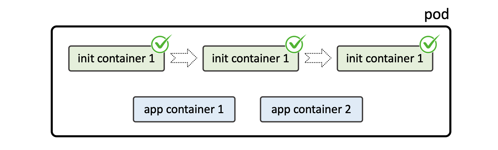

# What is Pod? How is it useful?
Here we’re about to learn and practice:

- Pods creation and configuration
- How Pods manage containers
- Troubleshooting various issues with Pods

## 1. Pod Overview


Pods are the smallest, most basic deployable objects in Kubernetes. A Pod represents a single instance of a running process in your cluster.

**You can consider a Pod to be a self-contained, isolated “logical host” that contains the systemic needs of the application it serves.**

Pods contain one or more containers, such as Docker containers. When a Pod runs multiple containers, the containers are managed as a single entity and share the Pod’s resources. Generally, running multiple containers in a single Pod is an advanced use case.

Pods also contain shared networking and storage resources for their containers:

- **Network**: Pods are automatically assigned unique IP addresses. Pod containers share the same network namespace, including IP address and network ports. Containers in a Pod communicate with each other inside the Pod on localhost.
- **Storage**: Pods can specify a set of shared storage volumes that can be shared among the containers.
Pods run on nodes in your cluster. Once created, a Pod remains on its node until its process is complete, the Pod is deleted, the Pod is evicted from the node due to lack of resources, or the node fails. If a node fails, Pods on the node are automatically scheduled for deletion.

Pods are **ephemeral**. They **are not** designed to run forever, and when a Pod is terminated it cannot be brought back. In general, Pods do not disappear until they are deleted by a user or by a controller.

Pods do not “heal” or repair themselves. For example, if a Pod is scheduled on a node which later fails, the Pod is deleted. Similarly, if a Pod is evicted from a node for any reason, the Pod does not replace itself.

## 2. Creating a Simple Pod


**Container**: Resides inside a pod and is the lowest level of a microservice which holds the running application, the libraries, and their dependencies.

**Pod**: The basic scheduling unit in Kubernetes, a pod consists of a group of one or more containers deployed to a single node. All containers in a pod share an IP address, IPC, hostname, and other resources. Pods abstract network and storage away from the underlying container, allowing you to move containers around the cluster easily.

### Pod Manifest Example
```sh
apiVersion: v1
kind: Pod
metadata:
  name: httpd-webserver-pod
  namespace: qa
  labels:
    env: test
    app: httpd
spec:
  containers:
  - name: webserver
    image: httpd:2.4.64-alpine
    imagePullPolicy: Always
    ports:
    - { name: http,  containerPort: 80 }
    - { name: https, containerPort: 443 }
```

### Task
You should create a pod by following requirements:
- Pod name: nginx-pod
- Pod image: nginx:alpine
- Pod label: app=nginx
- Namespace: default
- Container Port: 80

> Wait till this pod comes into Running state

### Verify
```sh
# Checking Pod status
$ kubectl get pod nginx-pod 
NAME        READY   STATUS    RESTARTS   AGE
nginx-pod   1/1     Running   0          30s

## Checking Image
$ kubectl describe pod nginx-pod | grep Image:
    Image:          nginx:alpine

$ kubectl get pod nginx-pod -o jsonpath='{.spec.containers[*].image}'
nginx:alpine

$ kubectl get pod nginx-pod \
    -o custom-columns='POD_NAME:metadata.name,IMAGE_NAME:spec.containers[*].image'
POD_NAME   IMAGE_NAME
nginx-pod  nginx:alpine

## Checking Labels
$ kubectl get pod nginx-pod --show-labels 
NAME        READY   STATUS    RESTARTS   AGE     LABELS
nginx-pod   1/1     Running   0          3m14s   app=nginx

## Checking Ports
$ kubectl get pod nginx-pod -o jsonpath='{.spec.containers[*].ports}'
[{"containerPort":80,"protocol":"TCP"}]
```

### Documentation
- [https://kubernetes.io/docs/concepts/workloads/pods/pod/](https://kubernetes.io/docs/concepts/workloads/pods/pod/)
- [https://kubernetes.io/docs/concepts/workloads/pods/pod-overview/#pod-templates](https://kubernetes.io/docs/concepts/workloads/pods/pod-overview/#pod-templates)
- [https://kubernetes.io/docs/concepts/services-networking/connect-applications-service/](https://kubernetes.io/docs/concepts/services-networking/connect-applications-service/)

## 3. Init Containers



A Pod can have multiple containers running apps within it, but it can also have one or more init containers, which are run before the app containers are started.

We use init containers for running some stuff **before** main container starts.

Init containers are exactly like regular containers, except:
- Init containers always run to completion.
- Each init container must complete successfully before the next one starts.
```sh
apiVersion: v1
kind: Pod
metadata:
  name: pod
spec:
  restartPolicy: Never
  initContainers:
  - name: init-container-1
    image: ...
    ...
  - name: init-container-2
    ...
  - name: init-container-3
    ...
  containers:
  - name: app-container-1
    image: ...
    ...
  - name: app-container-2
    ...
```

If a Pod’s init container fails, Kubernetes repeatedly restarts the Pod until the init container succeeds. However, if the Pod has a `restartPolicy` of `Never`, Kubernetes does not restart the Pod.

### Documentation
- [https://kubernetes.io/docs/concepts/workloads/pods/init-containers/](https://kubernetes.io/docs/concepts/workloads/pods/init-containers/)
- [https://kubernetes.io/docs/concepts/workloads/pods/pod-lifecycle/#restart-policy](https://kubernetes.io/docs/concepts/workloads/pods/pod-lifecycle/#restart-policy)

## 4. Getting Pod Details

### Task
Please find a pod called `santa` and save its manifest (`yaml` output format) to `/root/santa.yml` (on client `host`).

### Useful Command
```sh
kubectl get \
  ${RESOURCE_TYPE} \
  ${RESOURCE_NAME} \
  --namespace ${NS_NAME} \
  -o yaml
```

### Documentation
- [https://kubernetes.io/docs/reference/kubectl/cheatsheet/#viewing-finding-resources](https://kubernetes.io/docs/reference/kubectl/cheatsheet/#viewing-finding-resources)
- [https://kubernetes.io/docs/concepts/workloads/pods/pod/](https://kubernetes.io/docs/concepts/workloads/pods/pod/)
- [https://kubernetes.io/docs/concepts/workloads/pods/pod-overview/#pod-templates](https://kubernetes.io/docs/concepts/workloads/pods/pod-overview/#pod-templates)

## 5. Getting Pod Details
### Task
Should we know where our pod is running on (node name) or its IP address, the most easiest way is to get “extended” details with wide output format.

Please get all pods (from wonderland ns) details in wide format and save it into /to_check/wonderland-pods.yaml on client host

### Useful Command
```sh
kubectl get \
  ${RESOURCE_TYPE} \
  ${RESOURCE_NAME} \
  --namespace ${NS_NAME} \
  -o wide
```

### Documentation
- [https://kubernetes.io/docs/reference/kubectl/cheatsheet/#viewing-finding-resources](https://kubernetes.io/docs/reference/kubectl/cheatsheet/#viewing-finding-resources)
- [https://kubernetes.io/docs/concepts/workloads/pods/pod/](https://kubernetes.io/docs/concepts/workloads/pods/pod/)

## 6. Troubleshooting Pods

### Challenge
A new Pod web has been deployed. It has failed. Please find it, figure out the reason and fix it.

```sh
$ kubectl get pods -n ???
NAME   READY   STATUS         RESTARTS   AGE
web    0/1     ErrImagePull   0          6s

# kubectl get pods -n ???
NAME   READY   STATUS             RESTARTS   AGE
web    0/1     ImagePullBackOff   0          28s
```
### Requirements
- **Image**: `nginx` of `v1.19` based on `alpine`
- **Pod Status**: `Running`

### Verify
```sh
$ kubectl get pods -n ???
NAME   READY   STATUS    RESTARTS   AGE
web    1/1     Running   0          93s
```

### Documentation
- [https://kubernetes.io/docs/concepts/workloads/pods/pod/](https://kubernetes.io/docs/concepts/workloads/pods/pod/)


## 7. Troubleshooting Pods

### Challenge
A new `redis-db` pod has been deployed. It failed. Please fix it.
```sh
$ kubectl get pods -n ???
NAME       READY   STATUS            RESTARTS   AGE
redis-db   0/1     Init:StartError   0          11s
```
> You can re-create a pod, but be careful.  
> Wait till this pod comes into Running state.  
> Don’t add overhead

### Howtos
How to get pod YAML manifest?
```sh
$ kubectl get po {pod_name} -o yaml > pod_manifest.yaml
```

How to apply pod manifest?
```sh
$ kubectl apply -f pod_manifest.yaml
```

How to delete pod?
```sh
$ kubectl delete po {pod_name}
```

How to edit running pod?
```sh
$ kubectl edit po {pod_name}
```

### Verify
```sh
$ kubectl get pods -n ???
NAME       READY   STATUS     RESTARTS   AGE
redis-db   0/1     Init:0/1   0          8s

$ kubectl get pods -n ???
NAME       READY   STATUS            RESTARTS   AGE
redis-db   0/1     PodInitializing   0          15s

$ kubectl get pods -n ???
NAME       READY   STATUS    RESTARTS   AGE
redis-db   1/1     Running   0          22s
```

### Documentation
- [https://kubernetes.io/docs/concepts/workloads/pods/pod/](https://kubernetes.io/docs/concepts/workloads/pods/pod/)
- [https://kubernetes.io/docs/concepts/workloads/pods/init-containers/](https://kubernetes.io/docs/concepts/workloads/pods/init-containers/)

## 8. Creating a Pod

Create a new pod named `redis` with `redis:123` image. And yes, the image name is wrong!

### Requirements
- Name: `redis`
- Image Name: `redis:123`
- Namespace: `default`

### Hints:
You can easily create a pod by following command:
```sh
kubectl run {pod_name} --image {image_name} -- {command} {args}
kubectl run {pod_name} --image {image_name} --command {command} {args}
```

Here’s a trick how to generate pod definition manifest:
```sh
kubectl run {pod_name} --image {image_name} --dry-run=client -o yaml
```

## 9. Troubleshooting Pods

### Task
Now please change that redis pod image to the correct version.

### Requirements
- Name: `redis`
- Image Name: `redis:5-alpine`

### Hints
You can choose one of the following approaches:

1. Not really good solution, but why not:
```sh
$ kubectl edit pod {pod_name}
```
2. Usually it’s used with deployments, but pod can be updated as well:
```sh
$ kubectl set image pod {pod_name} {container_name}={new_image}
```
3. Deployment would do this better:
```sh
$ kubectl get pod {pod_name} -o yaml > pod.yaml
$ vim pod.yaml
$ kubectl delete -f pod.yaml
$ kubectl apply -f pod.yaml
```
4. Verify:
```sh
$ kubectl get pod redis \
>   -o=custom-columns='POD_NAME:metadata.name,IMAGE_NAME:spec.containers[*].image'
POD_NAME   IMAGE_NAME
redis      redis:5-alpine
```

### Documentation
- [https://kubernetes.io/docs/reference/kubectl/cheatsheet/#editing-resources](https://kubernetes.io/docs/reference/kubectl/cheatsheet/#editing-resources)


## 10. Defining Environment Variables for a Container

When you create a Pod, you can set environment variables for the containers that run in the Pod. To set environment variables, include the `env` or `envFrom` field in the configuration file.

Following configuration file for the Pod defines an environment variable with name `DEMO_GREETING` and value `"Hello from the environment"`. Here is the configuration file for the Pod:

```sh
apiVersion: v1
kind: Pod
metadata:
  name: envar-demo
  labels:
    purpose: demonstrate-envars
spec:
  containers:
  - name: envar-demo-container
    image: gcr.io/google-samples/node-hello:1.0
    env:
    - name: DEMO_GREETING
      value: "Hello from the environment"
```

### Task
Create a Pod (namespace: `default`, name: `envtest`, image: `busybox:1.34`, container process: `env && sleep infinity`). Specify following ENV variables for the main container:

- **STUDENT_FIRST_NAME**: `Tushar`
- **STUDENT_LAST_NAME**: Sriva`stava
Check Pod logs with kubectl logs command. Should be similar to this:

```sh
$ kubectl logs envtest
...
STUDENT_FIRST_NAME=Tushar
STUDENT_LAST_NAME=Srivastava
...
```

Save actual POD’s logs (full output) into `/tmp/default-envtest.log` file (on `client` node)

```sh
$ kubectl logs envtest
$ kubectl logs envtest > /tmp/default-envtest.log
```

### Documentation
- [https://kubernetes.io/docs/tasks/inject-data-application/define-environment-variable-container/](https://kubernetes.io/docs/tasks/inject-data-application/define-environment-variable-container/)
- [https://kubernetes.io/docs/reference/kubectl/cheatsheet/#interacting-with-running-pods](https://kubernetes.io/docs/reference/kubectl/cheatsheet/#interacting-with-running-pods)
- [https://kubernetes.io/docs/tasks/debug-application-cluster/debug-running-pod/#examine-pod-logs](https://kubernetes.io/docs/tasks/debug-application-cluster/debug-running-pod/#examine-pod-logs)


## 11. Pod Termination

### Delete a pod with grace period
Pods terminate gracefully when their processes are complete. Kubernetes imposes a default graceful termination period of `30` seconds. When deleting a Pod you can override this grace period by setting the `--grace-period` flag to the number of seconds to wait for the Pod to terminate before forcibly terminating it. Set to `1` for immediate shutdown.
```sh
kubectl delete pod foo --grace-period=1
```

### Delete a pod using the type and name specified in `pod.json`.
```sh
kubectl delete -f ./pod.json
```

### Delete a pod based on the type and name in the JSON passed into stdin.
```sh
cat pod.json | kubectl delete -f -
```

### Delete pods and services with same names “baz” and “foo”
```sh
kubectl delete pod,service baz foo
```

### Delete pods and services with label name=myLabel.
```sh
kubectl delete pods,services -l name=myLabel
```

### Delete a pod with minimal delay
```sh
kubectl delete pod foo --now
```

### Force delete a pod on a dead node
```sh
kubectl delete pod foo --force
```

### Delete all pods
```sh
kubectl delete pods --all
```

### Task
Delete `envtest` pod.

### Documentation
- [https://kubernetes.io/docs/reference/generated/kubectl/kubectl-commands#delete](https://kubernetes.io/docs/reference/generated/kubectl/kubectl-commands#delete)

## Quiz
Choose the Correct Command:
### Q1 To create my_app pod
- *`kubectl run my_app --image {image_name} -- {command} {args}`
- `kubectl create my_app --image {image_name} -- {command} {args}`
- `kubectl run my_app --image {image_name} {command} {args}`

### Q2 To generate my_app pod manifest
- `kubectl run my_app --image {image_name} -- {command} {args} --dry-run=client -o yaml`
- `kubectl create my_app --image {image_name} -- {command} {args} --dry-run=client -o yaml`
- *`kubectl run my_app --image {image_name} --dry-run=client -o yaml -- {command} {args}`
- `kubectl run my_app --image {image_name} --dry-run=client -o yaml {command} {args}`

### Q3 To get my_app pod logs
- `kubectl describe pod my_app`
- `kubectl describe logs my_app`
- `kubectl get logs my_app`
- *`kubectl logs my_app`

### Q4 To get my_app pod events
- `kubectl get pod my_app`
- *`kubectl describe pod my_app`

### Q5 To kill `my_app` pod
- `kubectl kill pod my_app`
- *`kubectl delete pod my_app`
- `kubectl terminate my_app`