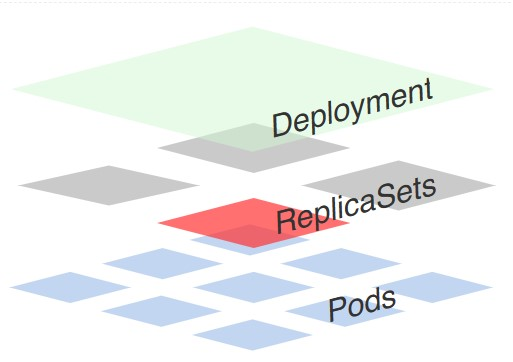
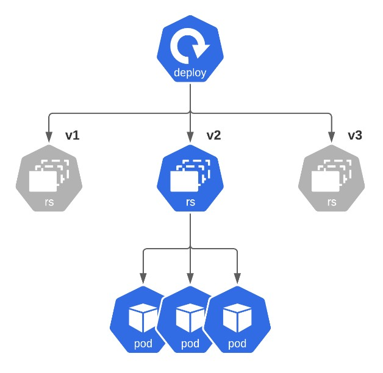

# Getting Familiar with Deployments


We are going to dive deep into “Deployment” Kubernetes workload:
- Creating Deployments
- Troubleshooting various issues with Deployments
- Getting familiar with how Kubernetes manages this workload

## 1. What is a Deployment?
Deployments represent a set of multiple, identical Pods with no unique identities. A Deployment runs multiple replicas of your application and automatically replaces any instances that fail or become unresponsive. In this way, Deployments help ensure that one or more instances of your application are available to serve user requests. Deployments are managed by the Kubernetes Deployment controller.

Deployments use a Pod template, which contains a specification for its Pods. The Pod specification determines how each Pod should look like: what applications should run inside its containers, which volumes the Pods should mount, its labels, and more.

When a Deployment’s Pod template is changed, new Pods are automatically created one at a time.

[Deployments in K8s - https://youtu.be/HPutXDwSWM0](https://youtu.be/HPutXDwSWM0)

> The deployment is (simply) responsible for rolling out your application, looking after its updates and rolling back to previous state - if needed. This is achieved because “Deployment” creates corresponding “Replicaset” per each deployment object



## 2. Creating Deployment

Example of Deployment Manifest:
```sh
apiVersion: apps/v1
kind: Deployment
metadata:
  name: nginx-deployment
  labels:
    app: nginx-deployment
spec:
  replicas: 3
  selector:
    matchLabels:
      app: nginx
  template:
    metadata:
      labels:
        app: nginx
    spec:
      containers:
      - name: nginx
        image: nginx:1.7.9
        ports:
        - containerPort: 80
```

In this example:

- A Deployment named nginx-deployment is created, indicated by the .metadata.name field.
- The Deployment creates three replicated Pods, indicated by the `replicas field.
- The Pod template, or .spec.template field, indicates that its Pods are labeled app=nginx.
- The Pod template’s specification, or .spec.template.spec field, indicates that the Pods run one container, name=nginx, which runs the nginx:1.7.9 Docker Hub image.
- The Deployment opens port 80 for use by the Pods.

### Task:
Create a new deployment called `nginx-deploy`

### Requirements:

- Name: `nginx-deploy`
- Image: `nginx:1.19-alpine`
- Replicas: `1`
- Labels:
  - `app=nginx-deploy`
> Make sure that pods are running

### Verify:
```sh
$ kubectl get deploy -l app=nginx-deploy
NAME           READY   UP-TO-DATE   AVAILABLE   AGE
nginx-deploy   1/1     1            1           1m17s

$ kubectl get replicaset -l app=nginx-deploy
NAME                      DESIRED   CURRENT   READY   AGE
nginx-deploy-5db957f468   1         1         1       1m19s

$ kubectl get pod -l app=nginx-deploy
NAME                            READY   STATUS    RESTARTS   AGE
nginx-deploy-5db957f468-frj8w   1/1     Running   0          1m22s
```

### Documentation:
- [https://kubernetes.io/docs/concepts/workloads/controllers/deployment/](https://kubernetes.io/docs/concepts/workloads/controllers/deployment/)
- [https://cloud.google.com/kubernetes-engine/docs/concepts/deployment](https://cloud.google.com/kubernetes-engine/docs/concepts/deployment)


## 3. Creating Deployment. Quick Way

Please inspect following command:
```sh
kubectl create deployment --help
```
```
Create a deployment with the specified name.
Aliases:
deployment, deploy

Examples:
  # Create a deployment named my-dep that runs the busybox image.
  kubectl create deployment my-dep --image=busybox:1.34
  
  # Create a deployment with command
  kubectl create deployment my-dep --image=busybox -- date
  
  # Create a deployment named my-dep that runs the nginx image with 3 replicas.
  kubectl create deployment my-dep --image=nginx --replicas=3
  
  # Create a deployment named my-dep that runs the busybox image and expose port 5701.
  kubectl create deployment my-dep --image=busybox --port=5701

Options:
      --allow-missing-template-keys=true: If true, ignore any errors in templates when a field or
map key is missing in the template. Only applies to golang and jsonpath output formats.
      --dry-run='none': Must be "none", "server", or "client". If client strategy, only print the
object that would be sent, without sending it. If server strategy, submit server-side request
without persisting the resource.
      --field-manager='kubectl-create': Name of the manager used to track field ownership.
      --image=[]: Image names to run.
  -o, --output='': Output format. One of:
json|yaml|name|go-template|go-template-file|template|templatefile|jsonpath|jsonpath-as-json|jsonpath-file.
      --port=-1: The port that this container exposes.
  -r, --replicas=1: Number of replicas to create. Default is 1.
      --save-config=false: If true, the configuration of current object will be saved in its
annotation. Otherwise, the annotation will be unchanged. This flag is useful when you want to
perform kubectl apply on this object in the future.
      --template='': Template string or path to template file to use when -o=go-template,
-o=go-template-file. The template format is golang templates
[http://golang.org/pkg/text/template/#pkg-overview].
      --validate=true: If true, use a schema to validate the input before sending it

Usage:
  kubectl create deployment NAME --image=image -- [COMMAND] [args...] [options]

Use "kubectl options" for a list of global command-line options (applies to all commands).
```

### Task:
Inspect the details listed above, add necessary options to kubectl create deploy command to produce following deployment configuration:
- Name: `easy-peasy`
- Image: `quay.io/playpit/busybox:1.32`
- Replicas: `5`
- Command: `sleep infinity`

### Take into Account:
To **generate** Deployment manifest you should use the same command with these options:
```sh
--dry-run=client
-o yaml
```
> Make sure you use these options before command part `(-- ...)`

### Documentation:
- [https://kubernetes.io/docs/concepts/workloads/controllers/deployment/](https://kubernetes.io/docs/concepts/workloads/controllers/deployment/)
- [https://cloud.google.com/kubernetes-engine/docs/concepts/deployment](https://cloud.google.com/kubernetes-engine/docs/concepts/deployment)


## 4. Scaling Pods in Deployment

Ok, you have created `nginx-deploy` deployment with just `1` pod.
```sh
$ kubectl get pods
NAME                            READY   STATUS    RESTARTS   AGE
nginx-deploy-5db957f468-gj5d4   1/1     Running   0          23s
```

Let’s try to scale it mmm… to `6` replicas.

### Task
Scale `nginx-deploy` deployment to `6` replicas

### Advice
There’re several ways to do it:
1. edit a file you used for creating the resource, and re-apply
2. `kubectl edit deployment ...`
3. `kubectl scale ...`
```sh
kubectl scale --help
```

### Verify
```sh
$ kubectl get pods
NAME                            READY   STATUS    RESTARTS   AGE
nginx-deploy-5db957f468-2s6gn   1/1     Running   0          21s
nginx-deploy-5db957f468-gj5d4   1/1     Running   0          2m25s
nginx-deploy-5db957f468-hd84d   1/1     Running   0          21s
nginx-deploy-5db957f468-m9w6n   1/1     Running   0          21s
nginx-deploy-5db957f468-qkwx5   1/1     Running   0          21s
nginx-deploy-5db957f468-sjzsp   1/1     Running   0          21s
```

### Solution
1. Edit file and reapply
   1. `kubectl apply -f nginx-deploy.yaml`
2. `kubectl edit deployment nginx-deploy`
3. `kubectl scale`
   1. `kubectl scale --replicas=6 deployment/nginx-deploy`
   2. `kubectl scale --current-replicas=4 --replicas=6 deployment/nginx-deploy` Scale if provided conditions hold True

### Documentation
- [https://kubernetes.io/docs/reference/kubectl/cheatsheet/#scaling-resources](https://kubernetes.io/docs/reference/kubectl/cheatsheet/#scaling-resources)
- [https://kubernetes.io/docs/concepts/workloads/controllers/deployment/#scaling-a-deployment](https://kubernetes.io/docs/concepts/workloads/controllers/deployment/#scaling-a-deployment)


## 5. Deleting Pods

Check `nginx-deploy` related pods. Try to remove a few of them. RS (**ReplicaSet**) which is formed by deployment for managing the number of required pods replicas should bring them back.

Let’s check it!

Before:
```sh
$ kubectl get pods
NAME                            READY   STATUS    RESTARTS   AGE
nginx-deploy-5db957f468-57fv8   1/1     Running   0          2m33s
nginx-deploy-5db957f468-996nm   1/1     Running   0          64s
nginx-deploy-5db957f468-f96z5   1/1     Running   0          64s
nginx-deploy-5db957f468-qg5nv   1/1     Running   0          64s
nginx-deploy-5db957f468-sjkd8   1/1     Running   0          64s
nginx-deploy-5db957f468-wqhfn   1/1     Running   0          64s
```

After deleting one of the pods:
```sh
$ kubectl get pods
NAME                            READY   STATUS    RESTARTS   AGE
nginx-deploy-5db957f468-57fv8   1/1     Running   0          4m13s
nginx-deploy-5db957f468-996nm   1/1     Running   0          2m44s
nginx-deploy-5db957f468-dcm4d   1/1     Running   0          13s
nginx-deploy-5db957f468-f96z5   1/1     Running   0          2m44s
nginx-deploy-5db957f468-qg5nv   1/1     Running   0          2m44s
nginx-deploy-5db957f468-sjkd8   1/1     Running   0          2m44s
```

### Task
Delete one of pods and make sure a new one has been created.

### Solution
`kubectl delete pod nginx-deploy-58c9bf6ffd-bz4d5`

### Documentation
- [https://kubernetes.io/docs/reference/kubectl/cheatsheet/#deleting-resources](https://kubernetes.io/docs/reference/kubectl/cheatsheet/#deleting-resources)

## 6. Deployments

Create a deployment manifest file `/root/tsrivastava-app.yaml` based on requirements below. And deploy it.

### Requirements
- Deployment Name: `tsrivastava-app`
- Deployment Labels:
  - app: `tsrivastava-app`
  - student: `tsrivastava`
- Pod(s) Labels:
  - deploy: `tsrivastava-app`
  - kind: `redis`
  - role: `master`
  - tier: `db`
- Container:
  - Image: `redis:5-alpine`
  - Port: `6379`
  - Name: `redis-master`
- Init Container:
  - Image: `busybox:1.34`
  - Command: `sleep 10`

### Please Note!  
Try to avoid using constructions like:
```sh
command: [ "sh", "-c"]
args: ["sleep 10"]
```
or:
```sh
command: [ "sh", "-c", "sleep 10"]
```
Why?
Because `sleep` is a regular binary executable file which doesn’t require any shell wrappers
```sh
$ which sleep
/usr/bin/sleep
```

Also, the solution

### Documentation
- [https://kubernetes.io/docs/concepts/workloads/pods/pod/](https://kubernetes.io/docs/concepts/workloads/pods/pod/)
- [https://kubernetes.io/docs/concepts/workloads/pods/init-containers/](https://kubernetes.io/docs/concepts/workloads/pods/init-containers/)
- [https://kubernetes.io/docs/concepts/workloads/controllers/deployment/](https://kubernetes.io/docs/concepts/workloads/controllers/deployment/)


## 7. Updating Deployment

Let’s get back to the `nginx-deploy` deployment.
You should upgrade image version using rolling update to `nginx:1.21-alpine`.

Please check ReplicaSets status.

### Task
- Current deployment release has `nginx:1.19-alpine` image
- New release should use `nginx:1.21-alpine`
- use rolling update process

### Rolling Update Routine
```sh
kubectl set image --help
kubectl set image {RESOURCE_TYPE}/{RESOURCE_NAME} {CONTAINER_NAME}={NEW_IMAGE}

# Example:
# Set a deployment's nginx container image to 'nginx:1.9.1', and its busybox:1.34 container image to 'busybox:1.34'.
kubectl set image deployment/nginx busybox=busybox:1.34 nginx=nginx:1.9.1
```

### Verification
There should be 2 replicas as given below:
```sh
$ kubectl get rs -l app=nginx-deploy -o wide
NAME               DESIRED   CURRENT   READY   ...   IMAGES              ...
nginx-deploy-...   0         0         0       ...   nginx:1.19-alpine   ...
nginx-deploy-...   6         6         6       ...   nginx:1.21-alpine   ...
```

Note, that currently the active deployment is that one which is set to `nginx:1.21-alpine` - `6` replicas

### Solution
```sh
kubectl set image deployment/nginx-deploy nginx=nginx:1.21-alpine
```

### Documentation
- [https://kubernetes.io/docs/reference/kubectl/cheatsheet/#updating-resources](https://kubernetes.io/docs/reference/kubectl/cheatsheet/#updating-resources)
- [https://kubernetes.io/docs/concepts/workloads/controllers/deployment/](https://kubernetes.io/docs/concepts/workloads/controllers/deployment/)


## 8. Rolling Back

Now please get back to previous version of the deployment: `nginx:1.21-alpine`. You can get details about `kubectl rollout undo ...` command in the help docs.

Once it’s done, please check what you have got with the same command as previously:
```sh
$ kubectl rollout undo deploy nginx-deploy

$ kubectl get rs -l app=nginx-deploy  -o wide
NAME               DESIRED   CURRENT   READY   ...   IMAGES              ...
nginx-deploy-...   6         6         6       ...   nginx:1.19-alpine   ...
nginx-deploy-...   0         0         0       ...   nginx:1.21-alpine   ...
```

### Solution
```sh
kubectl rollout undo deployment/nginx-deploy
```

### Documentation
- [https://kubernetes.io/docs/concepts/workloads/controllers/deployment/](https://kubernetes.io/docs/concepts/workloads/controllers/deployment/)


## 9. Troubleshooting Deployments

New `orange` deployment has been created, but it doesn’t work properly.

### Task
Find it, figure out the root cause and fix the issue.

### Requirements
- Pod associated with this deployment should be up and running
- Pod is waiting for 10 seconds before creating a container
- Please, change only necessary parameters

> Wait till it’s fully up and running

### Solution
Edit the deployment to fix the version of images used and command
```sh
kubectl edit deployment
```

### Documentation:
- [https://kubernetes.io/docs/concepts/workloads/controllers/deployment/](https://kubernetes.io/docs/concepts/workloads/controllers/deployment/)


## 10. Troubleshooting Deployments

### Task
A new kind of citrus deployment has been created ( find it by creation time), but there are no pods associated with it.

Figure out the root cause and fix the issue

> Wait till it’s fully up and running

### Solution
```sh
$ kubectl get deploy -A
NAMESPACE     NAME              READY   UP-TO-DATE   AVAILABLE   AGE
default       nginx-deploy      6/6     6            6           2d2h
orange        orange            2/2     2            2           9m30s
lemon         lemon             0/0     0            0           2m48s

$ kubectl scale deployment/lemon -n lemon --replicas=1
```
### Documentation
- [https://kubernetes.io/docs/concepts/workloads/controllers/deployment/](https://kubernetes.io/docs/concepts/workloads/controllers/deployment/)


## 11. Troubleshooting Deployments

### Task
There’s `/opt/practice/tomato.yaml` manifest file. It is lack of some key details.
Please add (do not delete any of existing fields) necessary configuration and apply it.

### Solution
```sh
```
### Validation
```sh
$  kubectl get deploy -n tomato
NAME     READY   UP-TO-DATE   AVAILABLE   AGE
tomato   3/3     3            3           1
```


## Conclusion
We have practiced and learned basic concepts and approaches of observing, managing, creating and troubleshooting of Kubernetes Deployment

Hope, you have enjoyed these scenarios

Please note some useful commands:
```sh
kubectl get deploy
kubectl describe deploy deployment-name

kubectl create deployment new-deployment --image nginx:1.19-alpine
kubectl scale deployment new-deployment --replicas=3

kubectl create deployment new-deployment --image nginx --dry-run=client -o yaml > /root/new-deployment.yaml

kubectl set image deployment/nginx *=nginx:1.9.1
kubectl rollout undo deployment/nginx
```