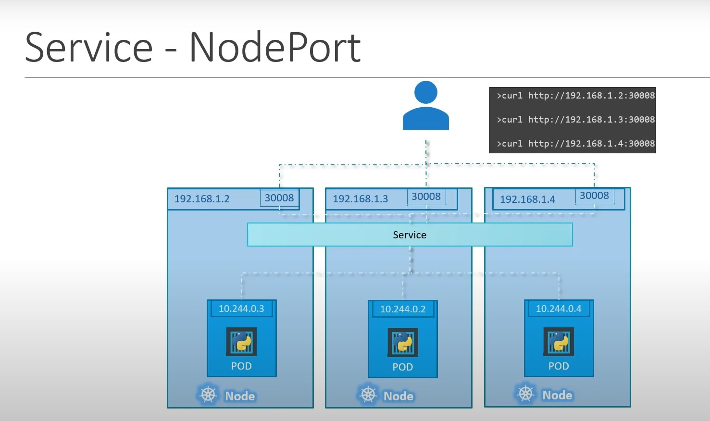
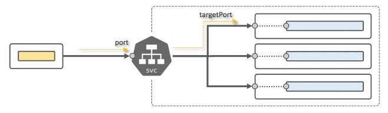

# Services in Kubernetes

We’re about to get acquainted with Services:
- Services types: 
  - ClusterIP
  - NodePort
  - LoadBalancer
  - ExternalName
- DNS Resolution with Services
- Headless Services
- ExternalIP
- Service Topology
- Troubleshooting

## 1. Intro

**Service** - an abstract way to expose an application running on a set of `Pod`s as a network service (thought it’s an internal LoadBalancer).

[!K8s Service Explained](https://youtu.be/5lzUpDtmWgM)



Using commands as given below, please discover answers to the Quiz.
```sh
kubectl get svc
kubectl get svc -o wide
kubectl get svc --all-namespaces
kubectl describe svc -n <<namespace name>> <<service name>>
kubectl get svc -n <<namespace name>> <<service name>> -o yaml
```

Endpoint - a list of backends (pods ip addresses):
```sh
kubectl get ep
kubectl describe ep -n <<namespace name>> <<service name>>
```

Typical Service Representation:


### Service Key Points:
- Similar to LoadBalancers, `service` aggregates `pods`
- If any new `pod`s had a specific label, the `service` would know how to send traffic to it.
- Service selector matches a pod label
- Service (usually) has Cluster internal IP (of the same network where Pods are running) and is always avaialable by its name
- Along with its IP, `service` has other key options:
  - `port` - TCP Port for incoming connections
  - `targetPort` - TCP port of destination (backend) `pod`

### Endpoint
- `endpoint` (also `ep`) is an automatically configured list of backends matched by `service` selector
- `endpoint` can have items from outside the cluster (external IPs or domain names)

Endpoint (`ep`) is a list of backends

### Documentation
- [https://kubernetes.io/docs/concepts/services-networking/service/](https://kubernetes.io/docs/concepts/services-networking/service/)
- [https://theithollow.com/2019/02/04/kubernetes-endpoints/](https://theithollow.com/2019/02/04/kubernetes-endpoints/)


## 2. Service Type: ClusterIP

So, in Kubernetes `Service` is a set of pods that works together and are defined by a label selector, services decouple work definitions from the pods.

`ClusterIP` exposes the Service on a cluster-internal IP. Choosing this value makes the Service only reachable from within the cluster. This is the default `ServiceType`.


### Cluster IP
Defines a logical set of pods and policy by which to access them
- it is an abstraction on top of the pods
- it uses selector to create a logical set of pods
- it gets stable Virtual IP and Port
- it is only available within K8s Cluster

### ClusterIP Explained:

- [https://youtu.be/dVDElh_Kd48](https://youtu.be/dVDElh_Kd48)

### Service Example:
```sh
apiVersion: v1
kind: Service
metadata:
  name: my-service
spec:
  selector:
    app: MyApp
  ports:
    - protocol: TCP
      port: 80
      targetPort: 9376
```

Here, service `my-service` has own ip address (ClusterIP, will be provided automatically) in Kuberenetes internal pod network, ready to get requests on port=80 and will downstream them to pods labeled `app=MyApp` to port `9376`




### Task


- Create `pod-info-svc` service for `pod-info-app` deployment
  - Name: `pod-info-svc`
  - Type: `ClusterIP`
  - Service Port: `80`
  - Service TargetPort: `80`
  - Investigate `pod-info-app` deployment and choose selector
  - Do not change `pod-info-app` deployment
- Run a pod (based on image `busybox:1.28`) and execute following commands (as given below) inside this pod and save outputs into files on client host:
  - `wget -q -O- pod-info-svc` save to `/root/testing-clusterip-web.log` (on `client` node!)
  - `nslookup pod-info-svc` save to `/root/testing-clusterip-nslookup.log` (on `client` node!)

### Example:
```sh
# kubectl run test --image busybox:1.28 -i --tty --rm -- sh
If you don't see a command prompt, try pressing enter.

/ # nslookup pod-info-svc
Server:    10.96.0.10
Address 1: 10.96.0.10 kube-dns.kube-system.svc.cluster.local

Name:      pod-info-svc
Address 1: 10.101.149.153 pod-info-svc.default.svc.cluster.local

/ # wget -q -O- pod-info-svc
...
System Info:
  - Hostname: "pod-info-app-868c998896-lnwrr"
  - Address: "10.244.1.12"
  - System Time: "Sunday, 22-Nov-20 08:53:21 UTC"
  - System Up Time: "29.39s"
  - Run as User: "root(0:0)"
...

/# wget -q -O- pod-info-svc.default.svc.cluster.local
...
System Info:
  - Hostname: "pod-info-app-868c998896-lnwrr"
  - Address: "10.244.1.12"
  - System Time: "Sunday, 22-Nov-20 08:57:51 UTC"
  - System Up Time: "5m0.02s"
  - Run as User: "root(0:0)"
...

/ # exit
Session ended, resume using 'kubectl attach test -c test -i -t' command when the pod is running
pod "test" deleted
```

### Problems?
`nslookup` doesn’t work properly on `busybox:1.34`?
Yes, it’s well-known bug. Use `busybox:1.27 or busybox:1.28 (< 1.28.4)`

```sh
$ kubectl run test --image busybox:1.34 -i --rm -- nslookup pod-info-svc
If you don't see a command prompt, try pressing enter.
Server:         10.43.0.10
Address:        10.43.0.10:53

Name:   pod-info-svc.default.svc.cluster.local
Address: 10.43.188.3

*** Can't find pod-info-svc.svc.cluster.local: No answer
*** Can't find pod-info-svc.cluster.local: No answer
*** Can't find pod-info-svc.default.svc.cluster.local: No answer
*** Can't find pod-info-svc.svc.cluster.local: No answer
*** Can't find pod-info-svc.cluster.local: No answer
pod "test" deleted
```

`kubectl run ...` stuck and didn’t show output?
Thought this should work, but it doesn’t:
```sh
$ kubectl run test --image busybox:1.28 -i --rm -- nslookup pod-info-svc
## long delay
pod "test" deleted
error: timed out waiting for the condition
```

Unfortunately yes, it should work, but it doesn’t do it for `busybox:1.34` images. Why? No idea.
But what to do?
Let’s try this:
```sh
$ echo nslookup pod-info-svc | kubectl run test --image busybox:1.27 -i --rm -- sh
```

### Solution
- `echo nslookup pod-info-svc | kubectl run test --image busybox:1.27 -i --rm -- sh > /root/testing-clusterip-nslookup.log`
- `echo wget -q -O- pod-info-svc | kubectl run test --image busybox:1.27 -i --rm -- sh > /root/testing-clusterip-web.log`
- Other straight forward solutions do not work on playpit platform


### Service Domain Name
Given you have service `my-app-service` created in `my-app-ns` namespace, you can reach it (internally, within cluster) by following names:

- Domain Name : Visibility
- my-app-service:	within my-app-ns
- my-app-service.my-app-ns	within my-app-ns, from other namespace
- my-app-service.my-app-ns.svc	within my-app-ns, from other namespace
- my-app-service.my-app-ns.svc.cluster.local	within my-app-ns, from other namespace

### Documentation
- [https://kubernetes.io/docs/concepts/services-networking/service/] (https://kubernetes.io/docs/concepts/services-networking/service/)
- [https://kubernetes.io/docs/concepts/services-networking/service/#publishing-services-service-types] (https://kubernetes.io/docs/concepts/services-networking/service/#publishing-services-service-types)
- [https://dzone.com/articles/routing-external-traffic-into-your-kubernetes-serv] (https://dzone.com/articles/routing-external-traffic-into-your-kubernetes-serv)

## 3. Service Type: ClusterIP=None - Headless Service

Sometimes you don’t need load-balancing and the single Service IP.

**What about having just an “A” like record with selected pods IP addresses? This is what “Headless Service” does.
**
For headless Services, a cluster IP is not allocated, kube-proxy does not handle these Services, and there is no load balancing or proxying done by the platform for them. How DNS is automatically configured depends on whether the Service has selectors defined.

### Headless Services With selectors
For headless Services that define selectors, the endpoints controller creates Endpoints records in the API, and modifies the DNS configuration to return records (addresses) that point directly to the Pods backing the Service.
```sh
apiVersion: v1
kind: Service
metadata:
  name: headless-service
spec:
  clusterIP: None
  selector:
    app: application
```
You don’t need to specify ports for the headless service, because it’s only DNS record, and you will be routed directly to the pod chosen by selector

### Task
- Create deployment `myapp`, image: `sbeliakou/web-pod-info:v1`, replicas: `1`
- Create headless service `myapp-headless` (`ClusterIP=None`) pointing to `myapp` pods
- Create non-headless service `myapp-clusterip` (`ClusterIP=ClusterIP`) pointing to `myapp` pods

 Headless service is a way to define DNS name for a pod within the cluster

### Verification
Checking Services
```sh
$ kubectl get svc myapp-clusterip myapp-headless
NAME               TYPE        CLUSTER-IP     EXTERNAL-IP   PORT(S)   AGE
myapp-clusterip    ClusterIP   10.102.42.35   <none>        80/TCP    2m57s
myapp-headless     ClusterIP   None           <none>        <none>    3m16s
```

Checking Pods
```sh
$ kubectl get pods -o custom-columns=POD:.metadata.name,IMAGE:.spec.containers[0].image,IP:.status.podIP
POD                     IMAGE                      IP
myapp-d968f89cb-n7fvj   sbeliakou/web-pod-info:v1  10.244.1.18
```

Checking name resolution:
Non-headless service has own IP address (and port), and proxies traffic to backends:
```sh
$ kubectl run --rm -it test --image=busybox:1.27 --restart=Never nslookup myapp-clusterip
Server:    10.96.0.10
Address 1: 10.96.0.10 kube-dns.kube-system.svc.cluster.local

Name:      myapp-clusterip
Address 1: 10.102.42.35 myapp-clusterip.default.svc.cluster.local
pod "test" deleted
```

In this example traffic flow between `test` pod and `myapp` pod looks like the following:
`test` -> `myapp-clusterip(10.102.42.35):80` => `10.244.1.18:80`

Headless service doesn’t proxy traffic to backends, it simply responds (on early dns lookup phase) with the IP address(es) where to go:
```sh
$ kubectl run --rm -it test --image=busybox:1.27 --restart=Never nslookup myapp-headless
Server:    10.96.0.10
Address 1: 10.96.0.10 kube-dns.kube-system.svc.cluster.local

Name:      myapp-headless
Address 1: 10.244.1.18 10-244-1-18.myapp-headless.default.svc.cluster.local
pod "test" deleted
```

In this example,
The traffic flow between test pod and myapp pod looks like the following:
`test` -> `myapp-headless(10.244.1.18):80`

### Documentation
- https://kubernetes.io/docs/concepts/services-networking/service/#headless-services
- https://dev.to/kaoskater08/building-a-headless-service-in-kubernetes-3bk8


## 4. Service Type: ExternalName

Services of type `ExternalName` map a `Service` to a `DNS` name, not to a typical selector such as `my-service` or `cassandra`.


```sh
apiVersion: v1
kind: Service
metadata:
  name: my-database
  namespace: prod
spec:
  type: ExternalName
  externalName: prod.database.example.com
```

**Note**: `ExternalName` accepts an IPv4 address string, but as a DNS names comprised of digits, not as an IP address. ExternalNames that resemble IPv4 addresses are not resolved by CoreDNS or ingress-nginx because ExternalName is intended to specify a canonical DNS name. To hardcode an IP address, consider using `headless Services`

### Task

Create ExternalName service:
- name: `db`
- externalName: `prodb.a1b2c3d4wxyz.eu-west-1.rds.playpit.net`

### Documentation:
- https://kubernetes.io/docs/concepts/services-networking/service/#externalname


## 5. Service Type: NodePort
A Kubernetes nodePort service allows external traffic to be routed to the pods:

[https://youtu.be/eth7osiCryc](https://youtu.be/eth7osiCryc)


## 8. External IPs
If you have public IP Addresses assigned to (only) several cluster nodes, Kubernetes Services can be exposed on those externalIPs. Traffic that ingresses into the cluster with the external IP (as destination IP), on the Service port, will be routed to one of the Service endpoints. externalIPs are not managed by Kubernetes and are the responsibility of the cluster administrator.


In the Service spec, externalIPs can be specified along with any of the ServiceTypes. In the example below, “my-service” can be accessed by clients on “80.11.12.10:80” (externalIP:port)

```sh
apiVersion: v1
kind: Service
metadata:
  name: my-service
spec:
  selector:
    app: MyApp
  ports:
    - name: http
      protocol: TCP
      port: 80
      targetPort: 9376
  externalIPs:
    - 80.11.12.10
    - 80.11.12.11
    - 80.11.12.12
```

## 9. Service Type: LoadBalancer
If your Kubernetes cluster has integration with Cloud (using cloud-controller-manager), creating service type `LoadBalancer` creates Cloud Load Balancer and automatically integrates it with your K8s’ service.

For On-prem Kubernetes Clusters you can use “MetalLB” solution.


Brief Explanation: [https://youtu.be/xCsz9IOt-fs](https://youtu.be/xCsz9IOt-fs)

### Example
On cloud providers which support external load balancers, setting the type field to LoadBalancer provisions a load balancer for your Service. The actual creation of the load balancer happens asynchronously, and information about the provisioned balancer is published in the Service’s `.status.loadBalancer` field. For example:

```sh
apiVersion: v1
kind: Service
metadata:
  name: my-service
spec:
  selector:
    app: MyApp
  ports:
    - protocol: TCP
      port: 80
      targetPort: 9376
  clusterIP: 10.0.171.239
  type: LoadBalancer
status:
  loadBalancer:
    ingress:
    - ip: 192.0.2.127
```

Here, `clusterIP: 10.0.171.239` and `ip: 192.0.2.127` will be created automatically

### Documentation
- [https://kubernetes.io/docs/concepts/services-networking/service/#loadbalancer](https://kubernetes.io/docs/concepts/services-networking/service/#loadbalancer)


## 10. Service Topology
### Only Node Local Endpoints
A Service that only routes to node local endpoints. If no endpoints exist on the node, traffic is dropped:


Example:
```sh
apiVersion: v1
kind: Service
metadata:
  name: my-service
spec:
  selector:
    app: my-app
  ports:
    - protocol: TCP
      port: 80
      targetPort: 9376
  topologyKeys:
    - "kubernetes.io/hostname"
```

### Documentation
- [https://kubernetes.io/docs/concepts/services-networking/service-topology/#only-node-local-endpoints](https://kubernetes.io/docs/concepts/services-networking/service-topology/#only-node-local-endpoints)


## 11. Service Topology
### Prefer Node Local Endpoints

A Service that prefers node local Endpoints but falls back to cluster wide endpoints if node local endpoints do not exist:


Example:
```sh
apiVersion: v1
kind: Service
metadata:
  name: my-service
spec:
  selector:
    app: my-app
  ports:
    - protocol: TCP
      port: 80
      targetPort: 9376
  topologyKeys:
    - "kubernetes.io/hostname"
    - "*"
```

### Documentattion
- [https://kubernetes.io/docs/concepts/services-networking/service-topology/#prefer-node-local-endpoints](https://kubernetes.io/docs/concepts/services-networking/service-topology/#prefer-node-local-endpoints)

## 12. Service Topology
### Only Zonal or Regional Endpoints
A Service that prefers zonal then regional endpoints. If no endpoints exist in either, traffic is dropped.

Example:
```sh
apiVersion: v1
kind: Service
metadata:
  name: my-service
spec:
  selector:
    app: my-app
  ports:
    - protocol: TCP
      port: 80
      targetPort: 9376
  topologyKeys:
    - "topology.kubernetes.io/zone"
    - "topology.kubernetes.io/region"
```

### Documentation
- [https://kubernetes.io/docs/concepts/services-networking/service-topology/#only-zonal-or-regional-endpoints](https://kubernetes.io/docs/concepts/services-networking/service-topology/#only-zonal-or-regional-endpoints)

## 13. Service Topology
### Prefer Node Local, Zonal, then Regional Endpoints
A Service that prefers node local, zonal, then regional endpoints but falls back to cluster wide endpoints.

Example:
```sh
apiVersion: v1
kind: Service
metadata:
  name: my-service
spec:
  selector:
    app: my-app
  ports:
    - protocol: TCP
      port: 80
      targetPort: 9376
  topologyKeys:
    - "kubernetes.io/hostname"
    - "topology.kubernetes.io/zone"
    - "topology.kubernetes.io/region"
    - "*"
```

### Documentattion
- [https://kubernetes.io/docs/concepts/services-networking/service-topology/#prefer-node-local-zonal-then-regional-endpoints](https://kubernetes.io/docs/concepts/services-networking/service-topology/#prefer-node-local-zonal-then-regional-endpoints)


## 14. Wrap Up

So, you have tried following types of services:
- ClusterIP
- NodePort
- LoadBalancer

Commands, you should have learned:
```sh
kubectl get svc
kubectl get svc -o wide
kubectl get svc --all-namespaces
kubectl describe svc -n <<namespace name>> <<service name>>
kubectl get svc -n <<namespace name>> <<service name>> -o yaml

kubectl get ep
kubectl describe ep -n <<namespace name>> <<service name>>

kubectl expose deployment <<deployment name>> \
  -n <<namespace name>> \
  --name <<svc name>> \
  --type <<svc type>> \
  --port <<svc port>> \
  --target-port <<svc targetPort == pod container port>>
```
