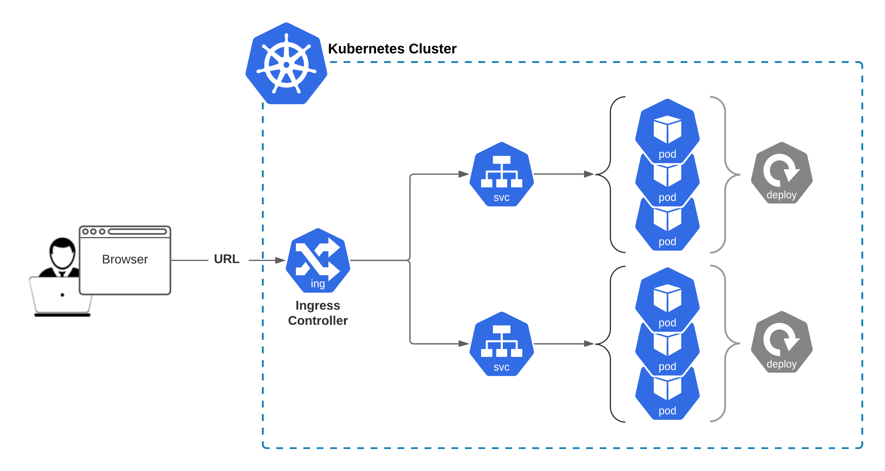
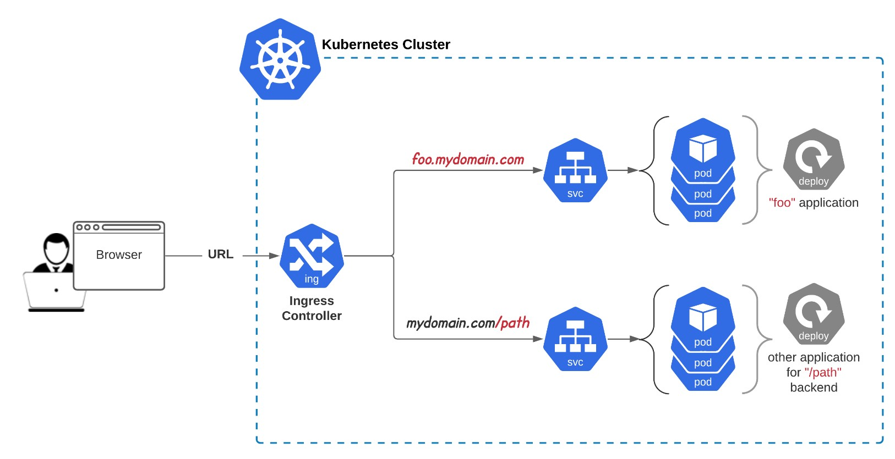
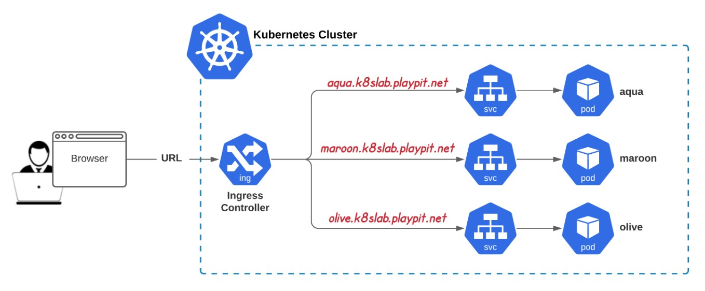
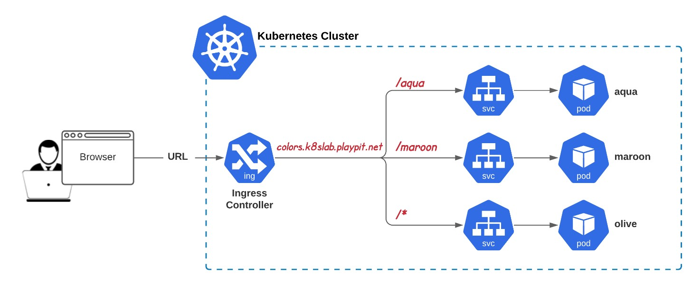
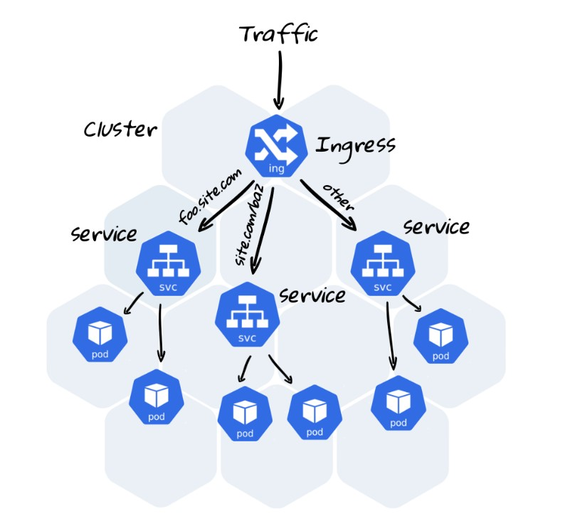
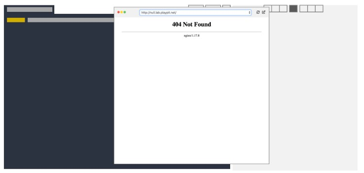

# Kubernetes Ingress Controller



Ingress Controller is aimed to provide Cluster Level single entry point to internal Deployment/Pods resources.  

This Module is about (at least) following:
- Nginx Ingress Controller
- Application Ingress Resources / Rules
- Default Backend (Maintenace Page)
- Troubleshooting and Fixing!

## 1. What is Ingress Controller?

An Ingress controller abstracts away the complexity of Kubernetes application traffic routing and provides a bridge between Kubernetes services and external ones. Kubernetes Ingress controllers: Accept traffic from outside the Kubernetes platform, and load balance it to pods (containers) running inside the platform.



An ingress Controller routes traffic **by domain name(s)**.

It’s not a part of Kubernetes standard installation and used to be installed separately.

There are a lot of different implementations of Ingress Controller. We have deployed one of the simplest IC: `kubernetes/ingress-nginx` from https://github.com/kubernetes/ingress-nginx

Technically, it’s an application stack of:
- deployment
- service
- config maps
- etc

[https://youtu.be/GhZi4DxaxxE](https://youtu.be/GhZi4DxaxxE)  

Please find more details here: docs/deploy/
If you browse the page http://k8slab.playpit.net you will find “404 Not Found” page, but it means that nothing is configured yet - there’re no routing/proxying rules created.

All of them are placed into `ingress-nginx` namespace

### Documentation
- [https://kubernetes.io/docs/concepts/services-networking/ingress/](https://kubernetes.io/docs/concepts/services-networking/ingress/)
- [https://cloud.google.com/kubernetes-engine/docs/concepts/ingress](https://cloud.google.com/kubernetes-engine/docs/concepts/ingress)
- [https://kubernetes.io/docs/concepts/services-networking/ingress-controllers/](https://kubernetes.io/docs/concepts/services-networking/ingress-controllers/)
- [https://kubernetes.github.io/ingress-nginx/](https://kubernetes.github.io/ingress-nginx/)


## 2. Ingress Resources. Name Based Virtual Hosting



### What is Ingress Controller?
Just a reminder from task #1. It’s a cluster-wide web service, which gets http/https requests from customers and routes traffic inside the cluster to corresponding Pods.

### What is Ingress (Resource or Rule)?
It’s a traffic routing configuration - this is how our Ingress Controller knows what request to sent to which pod.

### How to Configure Ingress Resource?
Here’s an example of Ingress resource

Name Based Virtual Hosting:

For k8s prior v1.19:
```sh
apiVersion: networking.k8s.io/v1beta
kind: Ingress
metadata:
  name: name-virtual-host-ingress
spec:
  rules:
  - host: foo.bar.com
    http:
      paths:
      - backend:
          serviceName: foo-svc
          servicePort: 80
```

For k8s v1.19+:

```sh
apiVersion: networking.k8s.io/v1
kind: Ingress
metadata:
  name: name-virtual-host-ingress
spec:
  rules:
  - host: foo.bar.com
    http:
      paths:
      - pathType: Prefix
        path: "/"
        backend:
          service:
            name: foo-svc
            port:
              number: 80
```

`networking.k8s.io/v1beta1` is deprecated in v1.19+, unavailable in v1.22+
Use `networking.k8s.io/v1` for k8s v1.19+

With this configuration http request to `foo.bar.com` should be routed to `foo-svc` service.

To see ingress resource (e.g. `foo-ingress`), use the command as following:

Describing Ingress Resource
```sh
$ kubectl describe ingress foo-ingress
Name:             foo-ingress
Namespace:        default
Address:          ...
Default backend:  default-http-backend:80 (...)
Rules:
  Host         Path  Backends
  ----         ----  --------
  foo.bar.com  
                  foo-svc:80
...
```

### Where Ingress Resouce Should be Created?
At least following ideas can come to mind:

1. Keep Ingress Resource in `ingress-nginx` namespace - close to Ingress Controller
2. Keep all Ingress Resources in separate (dedicated) namespace
3. Keep application related Ingress Resource in the same namespace where application workloads are created

**The best choice is option #3 - at least because of the following considerations:**
- It won’t require any additional privileges for end-user to manage other namespaces
- Easier Service Domain Names resolution (Ingress Resource -> Service) within the same namespace
- Eventual Consistency of entire application stack: all resources are running in the same namespace, and ease of deployment approach


### Documentation
- [https://kubernetes.io/docs/concepts/services-networking/ingress/](https://kubernetes.io/docs/concepts/services-networking/ingress/)
- [https://cloud.google.com/kubernetes-engine/docs/concepts/ingress](https://cloud.google.com/kubernetes-engine/docs/concepts/ingress)


## 3. Ingress Resources. Path Backends



### Context Path Based Routing
Imagine we have one domain name and we’d like to distribute microservices behind it. How to do this?

Here’s an example of Ingress Resource  
**For k8s prior v1.19:**
```sh
apiVersion: networking.k8s.io/v1beta1
kind: Ingress
metadata:
  name: simple-fanout-example
  annotations:
    nginx.ingress.kubernetes.io/rewrite-target: /
spec:
  rules:
  - host: foo.bar.baz.com
    http:
      paths:
      - path: /foo
        backend:
          serviceName: foo-service
          servicePort: 80
      - path: /bar
        backend:
          serviceName: bar-service
          servicePort: 8080
      - path:
        backend:
          serviceName: baz-service
          servicePort: 9090
```


**For k8s v1.19+:**
```sh
apiVersion: networking.k8s.io/v1
kind: Ingress
metadata:
  name: simple-fanout-example
  annotations:
    nginx.ingress.kubernetes.io/rewrite-target: /
spec:
  rules:
  - host: foo.bar.baz.com
    http:
      paths:
      - path: /foo
        pathType: Prefix
        backend:
          service:
            name: foo-service
            port:
              number: 80
      - path: /bar
        pathType: Prefix
        backend:
          service:
            name: bar-service
            port:
              number: 8080
      - path: /
        pathType: Prefix
        backend:
          service:
            name: baz-service
            port:
              number: 9090
```

### Documentation:
- [https://kubernetes.io/docs/concepts/services-networking/ingress/](https://kubernetes.io/docs/concepts/services-networking/ingress/)
- [https://cloud.google.com/kubernetes-engine/docs/concepts/ingress](https://cloud.google.com/kubernetes-engine/docs/concepts/ingress)


## 4. Ingress Controller



In our stand we use `ingress-nginx` Ingress controller - NGINX based image used as a reverse proxy and load balancer. The goal of this Ingress controller is the assembly of a configuration file (`/etc/nginx/nginx.conf`) from Ingress Resources.


## 5. Setting Up Custom Default Backend

Usually, if Ingress Controller cannot handle requests to the application (due to various errors), it responds with the default error page like below:


### Let’s customize the default (error) page!

Create the custom default-backend:
- Namespace: `ingress-default-backend`
- Deployment Name: `sorry-page`
- Image: `sbeliakou/http-sorry-page:v1`

Create a service with the name `sorry-page-service` (downstreams to `sorry-page` backend):
- Namespace: `ingress-default-backend`
- Service Name: `sorry-page-service`
- Type: `ClusterIP`
- Port: `80`

Configure `nginx-ingress-controller` deployment to use our custom error backend (--default-backend-service)