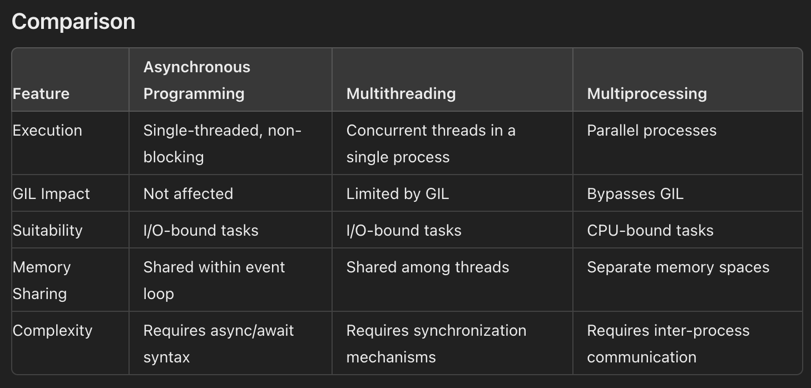

# Topics

- Async
- Multi-threading
- Async vs Multi-threading
- SOLID principles
- OOP Concepts
- Generic type
- GIL with example
- Memoization: function + argument => result caching

## Async vs Multithreading vs Multiprocessing

Async

- IO tasks
- Single process single thread
- Non blocking
- Single threaded so no GIL issue

Multi-threading

- IO tasks
- Single process multiple threads
- concurrent execution
- Race condition possible due to shared memory objects - solution: locks

Multi-processing

- CPU heavy
- Multiple processes so no GIL issue
- Parallel execution
- No shared memory so no race condition by default



### When to Use Each Approach

Asynchronous Programming: Use for I/O-bound tasks like network requests, file I/O, and other operations where waiting is involved.

Multithreading: Use for I/O-bound tasks where tasks can run concurrently, but be mindful of the GIL and potential race conditions.

Multiprocessing: Use for CPU-bound tasks that can benefit from parallel execution, as it bypasses the GIL and allows each process to run independently.

## Multithreading

Multithreading in Python allows you to run multiple threads (smaller units of a process) concurrently. This is particularly useful for I/O-bound tasks, such as reading and writing files, network operations, and database interactions. However, due to Python's Global Interpreter Lock (GIL), true parallel execution of Python bytecode is not possible, limiting the effectiveness of multithreading for CPU-bound tasks.

- Smaller units of a process
- IO bound tasks

## Memoization

Caching the result of expensive function calls based on arguments. A dict with args as keys and its computed result as values.

## SOLID Principles

1. Single Responsibility Principle (SRP): A class should have only one reason to change, meaning it should have only one job or responsibility.

```py
class Book:
    def __init__(self, title, author):
        self.title = title
        self.author = author

class BookPrinter:
    def print(self, book):
        print(f'{book.title} by {book.author}')
```

2. Open/Closed Principle (OCP): Software entities (classes, modules, functions, etc.) should be open for extension but closed for modification. This means you should be able to add new functionality without changing existing code.

```py
from abc import ABC, abstractmethod

class Notification(ABC):
    @abstractmethod
    def send(self, message):
        pass

class EmailNotification(Notification):
    def send(self, message):
        print(f"Sending email with message: {message}")

class SMSNotification(Notification):
    def send(self, message):
        print(f"Sending SMS with message: {message}")

def notify(notification: Notification, message: str):
    notification.send(message)

email_notifier = EmailNotification()
sms_notifier = SMSNotification()

notify(email_notifier, "Hello, World!")
notify(sms_notifier, "Hello, World!")

class PushNotification(Notification):
    def send(self, message):
        print(f"Sending push notification with message: {message}")

push_notifier = PushNotification()
notify(push_notifier, "Hello, World!")

```

3. Liskov Substitution Principle (LSP): Subtypes must be substitutable for their base types. In other words, objects of a superclass should be replaceable with objects of a subclass without affecting the functionality of the program.

```py
class Bird:
    def fly(self):
        pass

class Sparrow(Bird):
    def fly(self):
        print("Sparrow flying")

class Ostrich(Bird):
    def fly(self):
        raise Exception("Ostriches can't fly")
```

4. Interface Segregation Principle (ISP): Clients should not be forced to depend on interfaces they do not use. This means having many client-specific interfaces instead of one general-purpose interface.

```py
from abc import ABC, abstractmethod

class Printer(ABC):
    @abstractmethod
    def print(self, document):
        pass

class Scanner(ABC):
    @abstractmethod
    def scan(self, document):
        pass

class Fax(ABC):
    @abstractmethod
    def fax(self, document):
        pass

class MultiFunctionPrinter(Printer, Scanner, Fax):
    def print(self, document):
        print(f'Printing: {document}')

    def scan(self, document):
        print(f'Scanning: {document}')

    def fax(self, document):
        print(f'Faxing: {document}')

class SimplePrinter(Printer):
    def print(self, document):
        print(f'Printing: {document}')

```

5. Dependency Inversion Principle (DIP): High-level modules should not depend on low-level modules. Both should depend on abstractions. Also, abstractions should not depend on details. Details should depend on abstractions.

```py
from abc import ABC, abstractmethod

class Database(ABC):
    @abstractmethod
    def connect(self):
        pass

    @abstractmethod
    def fetch_data(self):
        pass

class MySQLDatabase(Database):
    def connect(self):
        print("Connecting to MySQL")

    def fetch_data(self):
        return "Data from MySQL"

class MongoDBDatabase(Database):
    def connect(self):
        print("Connecting to MongoDB")

    def fetch_data(self):
        return "Data from MongoDB"

class DataFetcher:
    def __init__(self, database: Database):
        self.database = database

    def fetch(self):
        self.database.connect()
        return self.database.fetch_data()

# Use MySQLDatabase
mysql_database = MySQLDatabase()
fetcher = DataFetcher(mysql_database)
print(fetcher.fetch())

# Switch to MongoDBDatabase
mongodb_database = MongoDBDatabase()
fetcher = DataFetcher(mongodb_database)
print(fetcher.fetch())
```

## GIL

The Python Global Interpreter Lock (GIL) is a mutex that protects access to Python objects, preventing multiple native threads from executing Python bytecodes at once. This lock is necessary because Python's memory management is not thread-safe. While the GIL simplifies the implementation of CPython and ensures thread safety, it can be a bottleneck in CPU-bound and multi-threaded programs.

Here's a simple example to illustrate the impact of the GIL:

Without GIL: Hypothetical Scenario

Imagine we have two threads performing a CPU-bound task like incrementing a counter. Without the GIL, both threads could run simultaneously on a multi-core processor, potentially halving the execution time.

With GIL: Real Scenario in CPython

In CPython, even if you have multiple threads, the GIL allows only one thread to execute Python bytecode at a time. This can lead to performance degradation in CPU-bound multi-threaded programs.

Example Code

Let's create an example where two threads increment a shared counter. We'll measure the execution time to see the effect of the GIL.

```python
import threading
import time

# A simple counter increment function
def increment_counter(counter, num_increments):
    for _ in range(num_increments):
        counter[0] += 1

# Number of increments
num_increments = 10**6

# Counter shared between threads
counter = [0]

# Create two threads
thread1 = threading.Thread(target=increment_counter, args=(counter, num_increments))
thread2 = threading.Thread(target=increment_counter, args=(counter, num_increments))

# Measure the execution time
start_time = time.time()

# Start the threads
thread1.start()
thread2.start()

# Wait for the threads to finish
thread1.join()
thread2.join()

end_time = time.time()

# Print the results
print(f"Counter value: {counter[0]}")
print(f"Execution time: {end_time - start_time} seconds")
```

Explanation

- **Increment Function:** The `increment_counter` function increments a shared counter a specified number of times.
- **Threads:** We create two threads, each incrementing the counter `num_increments` times.
- **Timing:** We measure the execution time to see how long it takes for both threads to complete their work.

Expected Output

Due to the GIL, you won't see a significant speedup from using multiple threads for this CPU-bound task. The counter value should be `2 * num_increments` (since both threads increment the counter independently), but the execution time might be roughly the same as if you were running the increments sequentially.

Observations

- **CPU-Bound Tasks:** For CPU-bound tasks, the GIL prevents Python from taking full advantage of multi-core processors.
- **I/O-Bound Tasks:** For I/O-bound tasks, threads can still be beneficial because the GIL is released during I/O operations, allowing other threads to run.

Alternatives

- **Multiprocessing:** For CPU-bound tasks, using the `multiprocessing` module can be a better alternative as it spawns separate processes, each with its own GIL.
- **C Extensions:** Writing performance-critical sections in C or using libraries like NumPy (which release the GIL) can also help bypass GIL limitations.

## OOP

- Class: Blueprint of an object, no data
- Object: An instance of a class with real data
- Encapsulation: Bundling attributes and methods
- Inheritance: Inherit attributes and methods
- Polymorphism: Common base class and behaviour
- Abstraction: hiding unnecessary details
